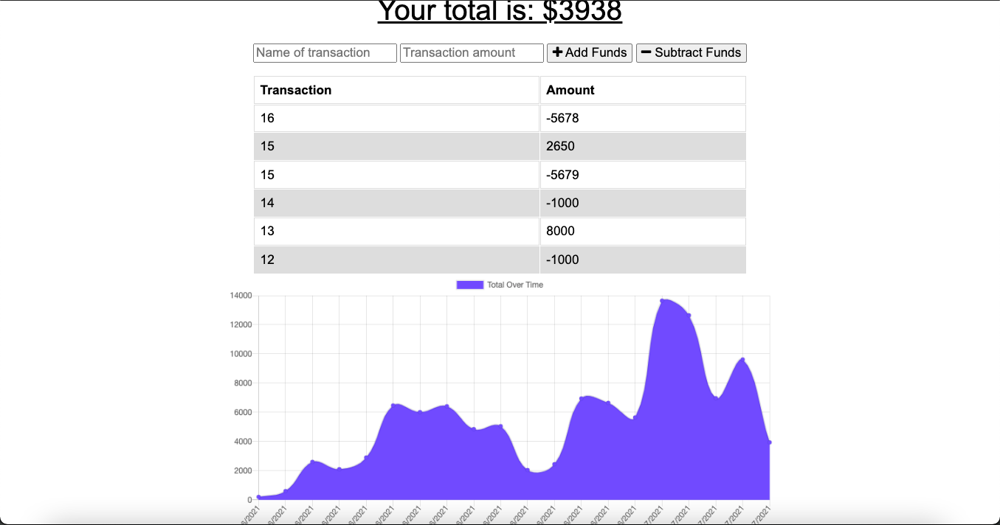

# Online-Offline Budget Trackers
  
## Description
Budget tracker application that allows offline access and functionality.

The user is able to add expenses and deposits to their budget with or without a connection. When entering transactions offline, they should populate the total when brought back online.

## Installation
This project has been deployed to GitHub. https://github.com/Eduadomtz/Online-Offline-Budget-Trackers

To get this project up and running, you can follow the deployment link. 

## Usage
Insert your expenses or deposits. They will be updated even if you work offline.

## Features
- HTML
- JS
- CSS
- MongoDB
- Manifest

  ## Questions
  If you have any questions about the repo, open an issue or contact me directly at eduardo31794@gmail.com You can find more of my work at https://github.com/Eduadomtz